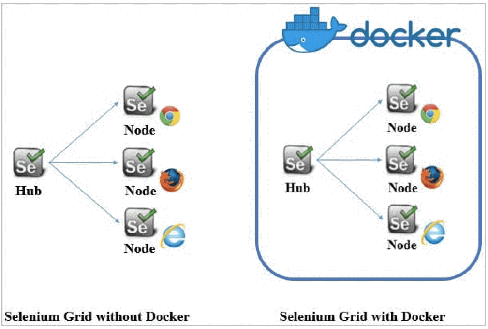
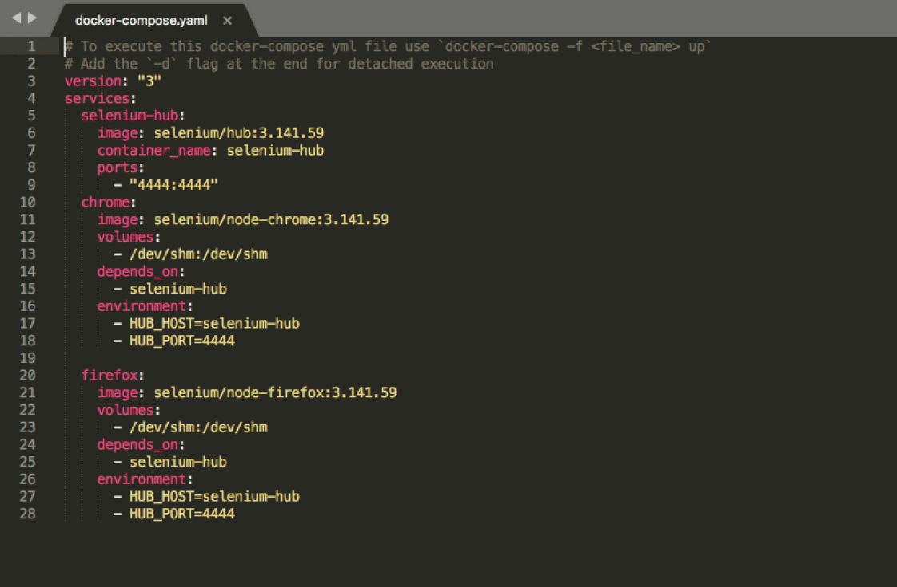
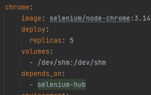
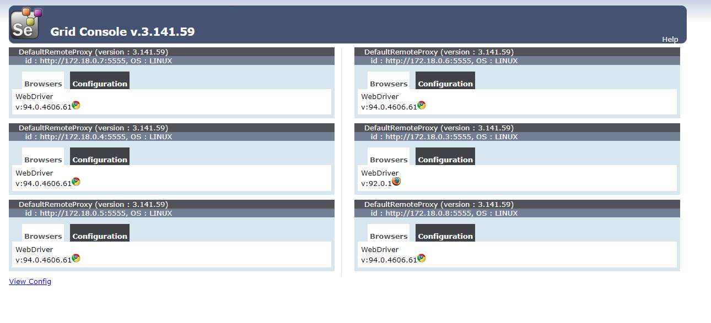

# AutomationExercise
- added chrome driver to run tests on chrome sequentially
- created page object model for test
- junit annotations to run test
- used annotations for parameterized tests
- created TestProperties to hold sensitive info
- cannot run through powershell need to run on terminal
- added support for edge
- created SuperTest class to be inherited by other test classes and reduce code duplication
- created PageObjectManager to hold all pages and to easily invoke
- created a new configuration to run tests in parallel
- attempted to limit the number of browser instances to be launched - unsuccessful. max 4 instances ran parallel successfully
- added TestNG annotations to use for parallel tests                                                                       
- attempted to use selenium grid standalone to execute tests

    # LEARNING ABOUT DOCKER
  - docker is used to create like a lightweight VM called containers to perform tests remotely
  - allows for parallel execution
  - example followed as in **https://www.engati.com/blog/docker-for-automation-testing**
  - By using docker with Selenium Grid , instead of VM’s we will use containers and all the nodes will be on the same OS.

  

  - Create a docker compose file to create the nodes to run the test in the root of the project
  
  

  - deploy selenium/hub as the image in the container to create a hub in this file.
  - Then we have 2 nodes for each browser in our example, one for chrome and the other for Firefox. They both are connected to the hub using depends_on.
  - on  terminal execute cmd "docker-compose -f <dockerComposeFile>.yaml up"
  - docker will start creating the container for selenium hub, chrome and firefox nodes
  - the localhost specified in the compose file will display the 2 nodes
  
  
    
  - Create a TestNG xml file to execute all the tests in the project.\

  - 

  - To increase the # of nodes in the compose file add **deploy**
  
  
  